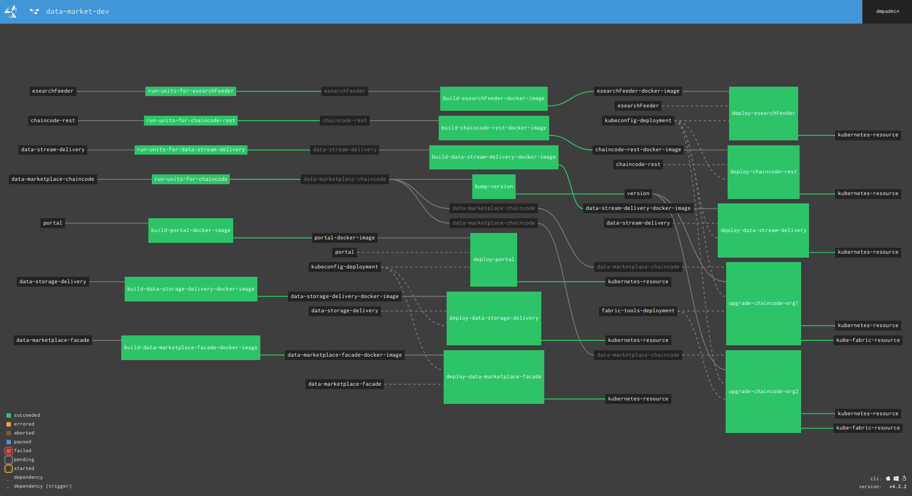

# Data Marketplace Concourse Pipeline
This is an exemple of concourse pipeline that enables CI/CD for the data marketplace. After deploying this pipeline, you should have a flow that allows to track all the new changes for the data marketplace and deploy them to your kubernetes cluster.



* Log in:

```
fly login -t datamarketplace -c http://<ip of your concourse>:8090  -u <username> -p <password>
```

* Setup a pipeline:
```
fly -t datamarketplace set-pipeline -p datamarketplace-dev -c devpipeline.yaml
```

* List workers:
```
fly -t datamarketplace workers
```

* Delete a stall worker:
```
fly -t datamarketplace prune-worker -w 4b0f2aab7008
```

* Connect to a container (exemple):
```
fly -t datamarketplace hijack -j data-storage-delivery/build-data-storage-delivery-docker-image
```

* Access to the pipeline:

Open `http://<concourse ip>:8090` in your browser ad use dmpadmin/test as user/password